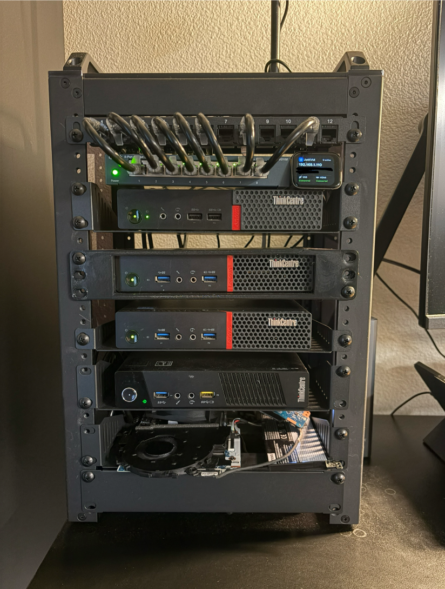
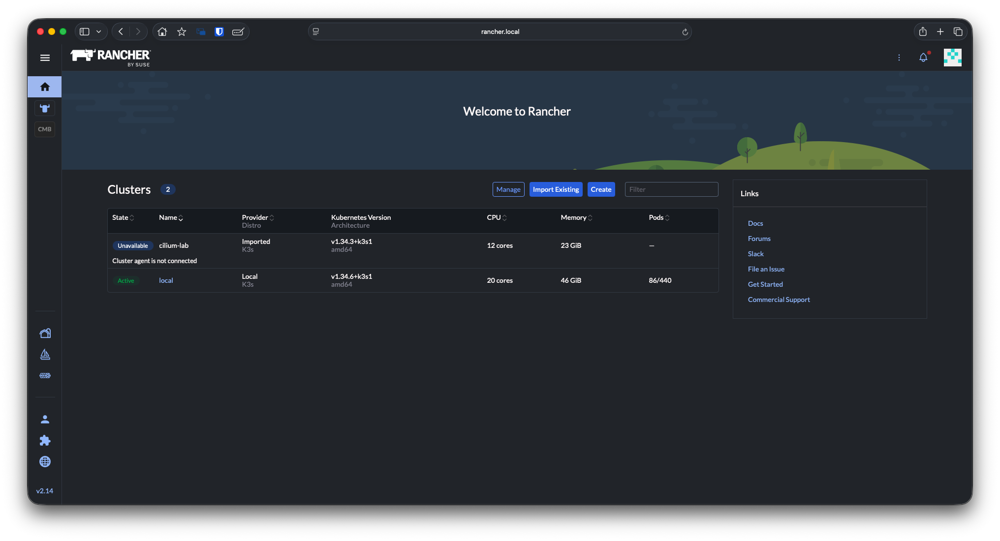
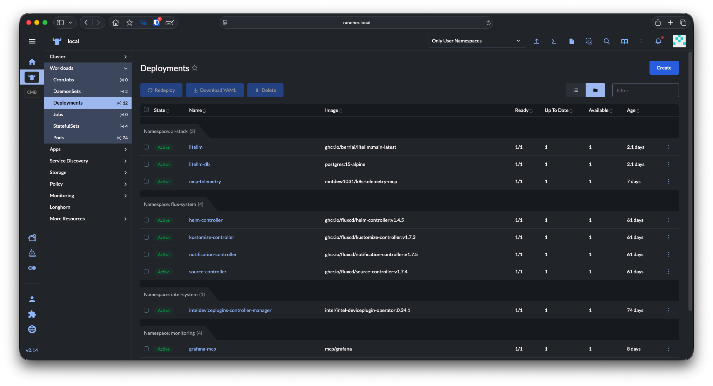
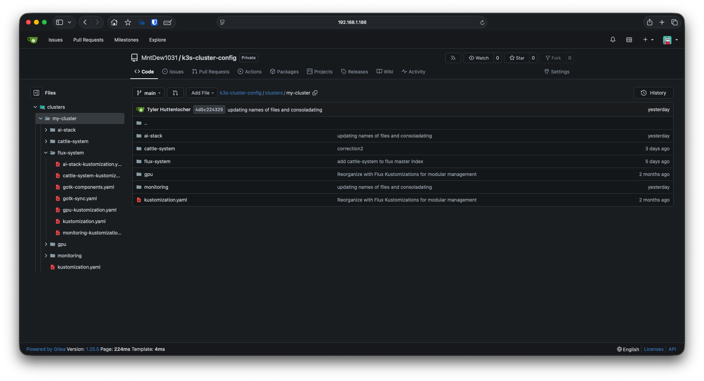
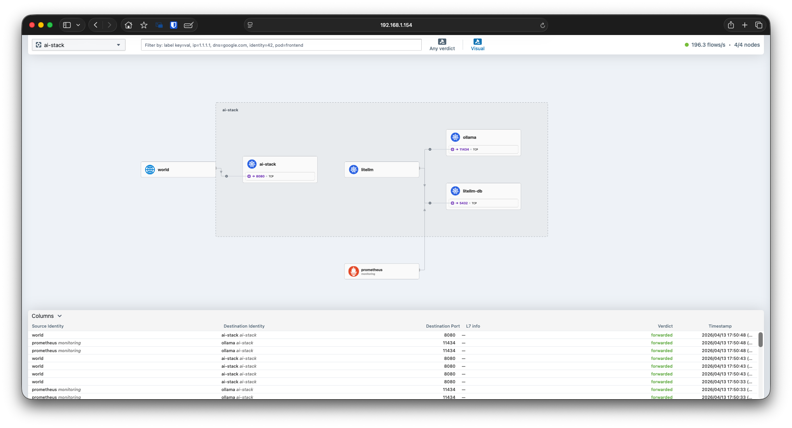
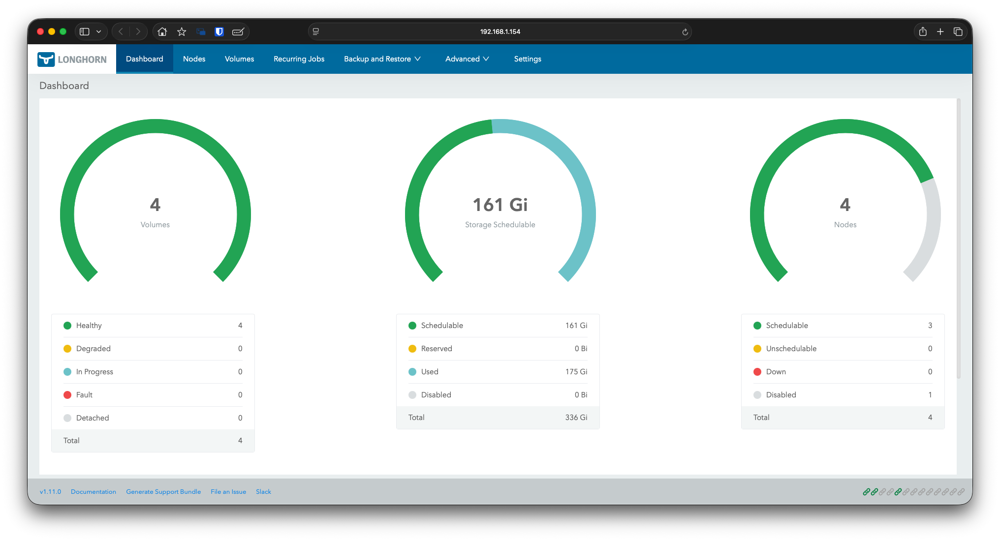
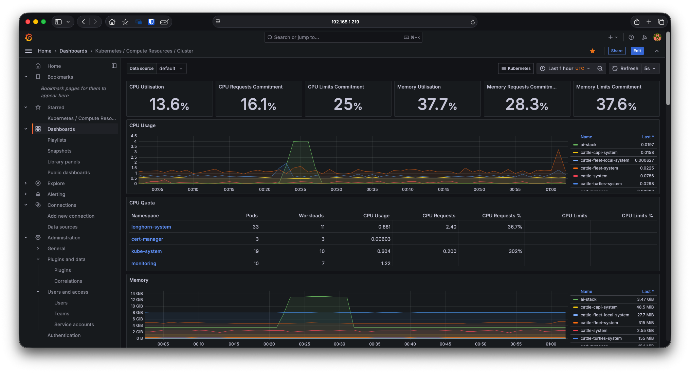
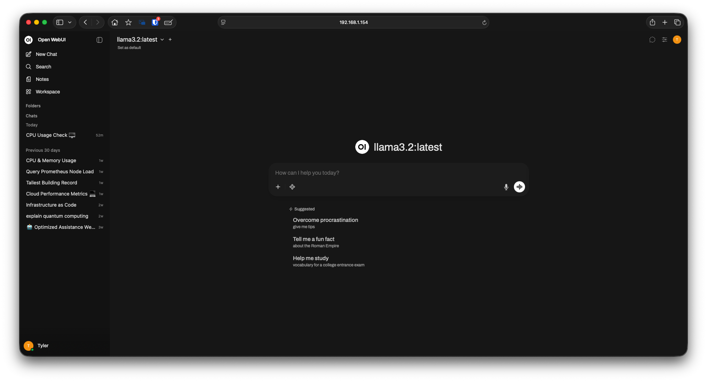
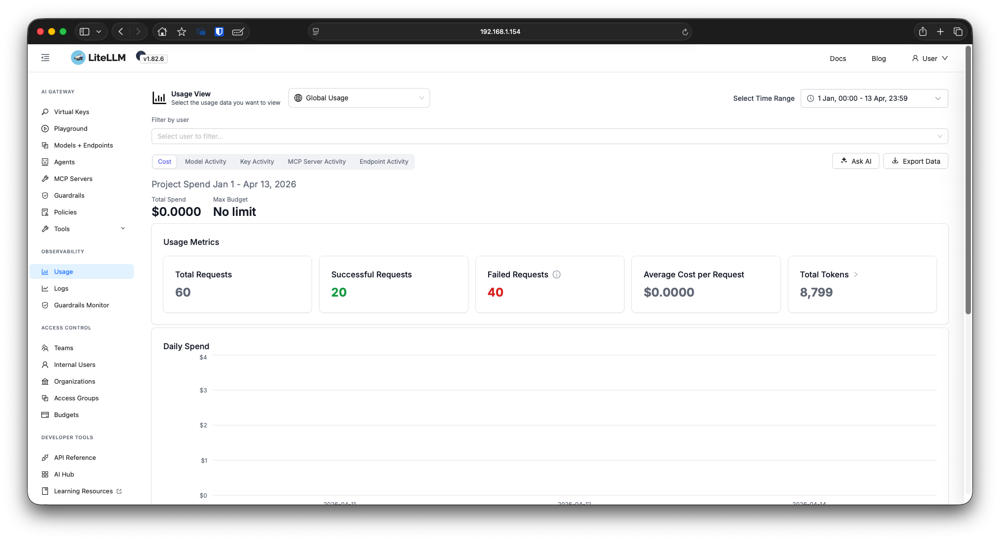

# K3s Bare Metal AI GitOps Architecture

## Overview

This repository contains the infrastructure as code for a highly available bare metal Kubernetes cluster dedicated to local AI workloads. The environment is provisioned using K3s and managed through Rancher across a 4-node topology. This cluster is built entirely for demonstration and portfolio purposes. It runs smaller local models just efficiently enough to prove the enterprise architecture works without igniting the CPUs to burn down my apartment.

**Note:** This is a (hopefully) sanitized public mirror of a self-hosted Gitea repository as of 04/12/2026.

* [Show me the specs](#hardware-topology)
* [What I am running](#core-infrastructure)
* [Just show me the pictures](#infrastructure-visuals)
* [You Received My Resume!](#you-received-my-resume)

## Hardware Topology

This is a homelab environment built to demonstrate complex systems engineering concepts rather than raw compute power. The nodes are all low wattage machines.

**ThinkCentre micro computers. Each is powered by a low voltage CPU:**

* **think1:** Intel Core i3-6100T | 16GB of RAM | Control Plane | 2nd node in the picture
* **think2:** Intel Pentium CPU N3700 | 8/16GB of RAM (One DIMM died i think ): ) | 3rd node in the picture
* **think3:** Intel Core i3-4130T | 8 GB of RAM | 4th node in the picture
* **think-frankenstein:** 13th Gen Intel Core i3-1315U | 16GB of RAM | 5th "node" (yea its a barebones laptop in a rack with questionable cpu cooling) | ironically running the AI models btw

## Core Infrastructure

* **Operating System:** Ubuntu Server
* **Orchestration:** K3s managed via [Rancher](#rancher-orchestration)
* **GitOps Controller:** [FluxCD with Kustomize](#fluxcd-and-kustomize)
* **Networking:** [Cilium CNI](#cilium-networking)
* **Storage:** Local storage managed via [Longhorn Storage](#longhorn-storage)
* **Observability:** [Prometheus, Grafana, and HubbleUI](#observability-dashboards)

## Local AI Pipeline & Tooling

The cluster was built to host a privacy-focused AI inference pipeline and custom integration tooling.

* **Inference Engine:** Ollama running smaller, (kinda) hardware friendly models like Llama 3.2 and Qwen 2.5.
* **API Gateway:** LiteLLM proxy enforcing enterprise grade rate limiting and strict request budgets.
* **Frontend:** [Open WebUI](#open-webui) deployed with strict role based access control (RBAC) to separate administrative and guest model access.
* **Custom Integrations:** A simple custom Model Context Protocol (MCP) server integrated directly into the AI stack with the ability to pull CPU and Memory metrics.

## Deployment Methodology

Changes pushed to the `main` branch of my self-hosted repository are automatically reconciled by FluxCD. The cluster architecture heavily utilizes Kustomize to patch base manifests and manage namespace configurations without duplicating code.

***

## Infrastructure Visuals

### Rancher Orchestration

### FluxCD and Kustomize

### Cilium Networking

### Longhorn Storage
 

### Observability Dashboards

### Open WebUI

### LiteLLM Dashboard

## You Received My Resume

If you received my resume then you already have the URL and the creds to login to the Open Web UI instance. Here are some steps to effectively test the AI stack:

1. **Basic Use of the AI models**
   * Yup, you guessed it, start a new chat by selecting the "New Chat" button on the left side panel.
   * Select what model you want to use by toggling the model drop down on the top left of the new chat panel.
     * (Pro tip, I recommend loading up qwen2.5 for the first test so the second is quicker).
   * Prompt the model anything you'd like!
     * The first prompt will be the slowest since the model will most likely not be loaded.
   * Assuming everything worked you will receive a response just like every other AI model.
2. **Testing the MCP Tool**
   * Start a new chat by selecting the "New Chat" button on the left side panel.
   * Now, you **need** to select the Qwen 2.5 model in order to use the MCP tool. (Top left corner drop down).
   * Click the 4 diamonds button on the bottom left of the chat, click the tools button (wrench logo), and toggle on the "mcp-telemetry" tool.
   * We will prompt this model to pull either CPU or Memory stats from any of the 4 nodes. Use my example prompt first for the best results:
     * Example: Check the current CPU usage for the think1 node using the telemetry tool.
     * Example: Check the current (CPU or Memory) usage for the (insert name of node) node using the telemetry tool.
   * This one will most likely take a bit longer as this is running on decade old hardware and most likely thermal throttling :)
   * BUT eventually it will produce a percentage amount for the usage of either the CPU or Memory!