<div align="center">

# Bare-Metal K3s GitOps Platform

### Production infrastructure patterns, local AI workloads, and custom platform services on five low-power nodes

**K3s · Flux CD · Cilium · Longhorn · Rancher · Prometheus · Grafana · Ollama · LiteLLM · Python**

This is a security-reviewed portfolio representation of a real production
homelab. It preserves the engineering decisions and working code while
excluding credentials, live topology, private image sources, and operational
identifiers.

</div>

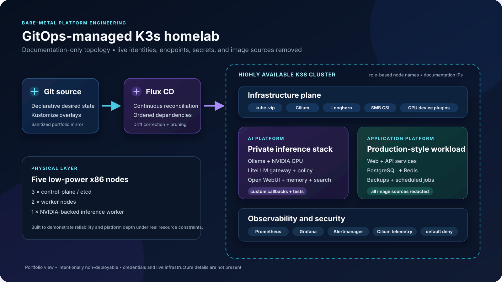

## At a glance

| Platform | Delivery | Workloads | Operations |
|---|---|---|---|
| Highly available K3s | Flux reconciliation | Local AI platform | Prometheus + Grafana |
| kube-vip API endpoint | Kustomize composition | Production web/API stack | Alertmanager |
| Cilium networking | Dependency ordering | Custom Python services | Cilium telemetry |
| Longhorn + SMB CSI | Drift correction | GPU-backed inference | Backup CronJobs |

> [!IMPORTANT]
> This repository is intentionally non-deployable. Documentation domains,
> documentation IP ranges, redacted image references, and unresolved Secret
> references replace the production values.

## Why I built this

I wanted a platform that demonstrates more than installing Kubernetes on spare
hardware. This environment exercises the same concerns that matter in larger
systems: control-plane availability, declarative delivery, storage behavior,
network boundaries, observability, workload isolation, failure recovery, and
safe change management.

Running that platform on constrained hardware makes the tradeoffs visible.
Scheduling, resource requests, rollout strategies, storage access modes, and
model selection all have immediate consequences. The result is a compact
environment that rewards deliberate engineering rather than excess capacity.

## Physical platform

<table>
  <tr>
    <td width="34%" align="center">
      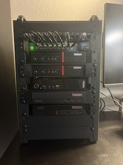
    </td>
    <td>
      <strong>Five compact x86 nodes</strong><br/><br/>
      Three nodes form the K3s server and embedded-etcd control plane. Two
      additional workers provide general compute, with one NVIDIA-backed worker
      dedicated to local inference.<br/><br/>
      A highly available virtual API endpoint removes dependence on any single
      control-plane node. Distributed storage and replicated workloads are
      designed to tolerate routine node maintenance and a single-node failure.
    </td>
  </tr>
</table>

## Platform in action

These are sanitized derivatives of the original application screenshots.
Browser chrome, LAN addresses, personal identity, private registry locations,
and repository history were removed or replaced. Dashboard values reflect the
time of capture rather than the current live state.

<table>
  <tr>
    <td width="50%" valign="top">
      <strong>GitOps source</strong><br/>
      Sanitized Gitea repository structure and Flux configuration.<br/><br/>
      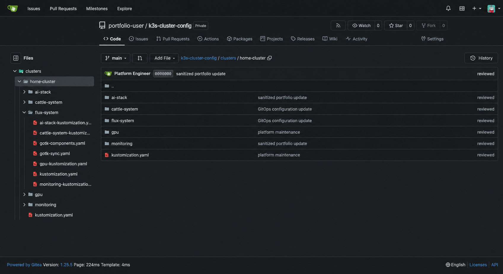
    </td>
    <td width="50%" valign="top">
      <strong>Rancher cluster management</strong><br/>
      Multi-cluster visibility and resource overview.<br/><br/>
      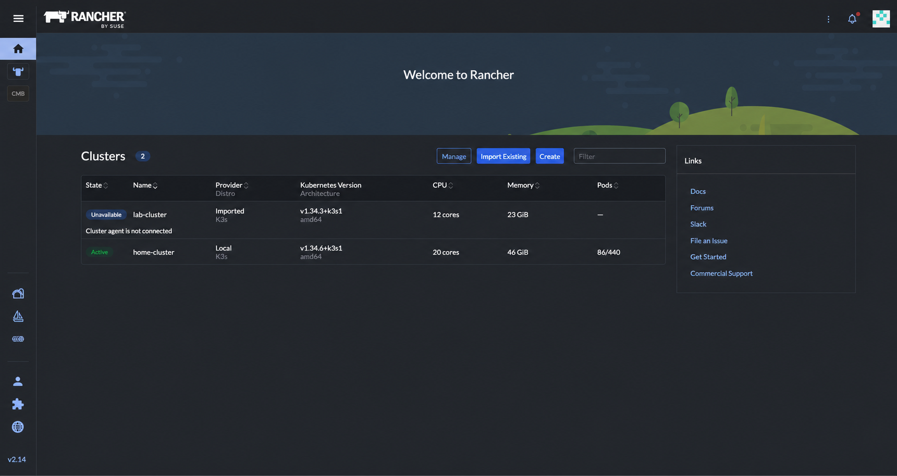
    </td>
  </tr>
  <tr>
    <td width="50%" valign="top">
      <strong>Rancher workloads</strong><br/>
      Deployment health across application and platform namespaces.<br/><br/>
      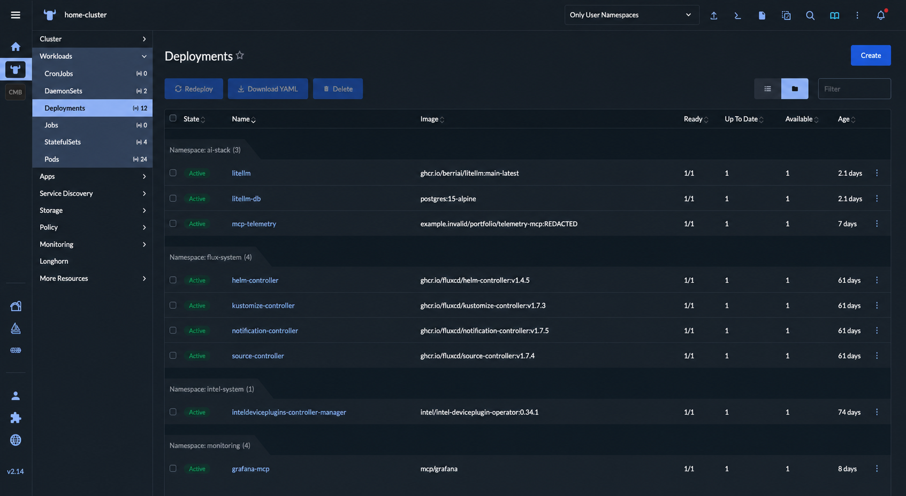
    </td>
    <td width="50%" valign="top">
      <strong>Grafana observability</strong><br/>
      Cluster CPU, memory, requests, limits, and namespace utilization.<br/><br/>
      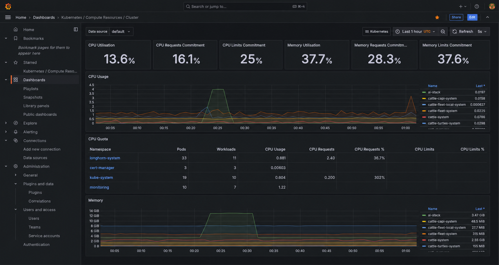
    </td>
  </tr>
  <tr>
    <td width="50%" valign="top">
      <strong>Cilium Hubble</strong><br/>
      Service-to-service flows and network-policy visibility.<br/><br/>
      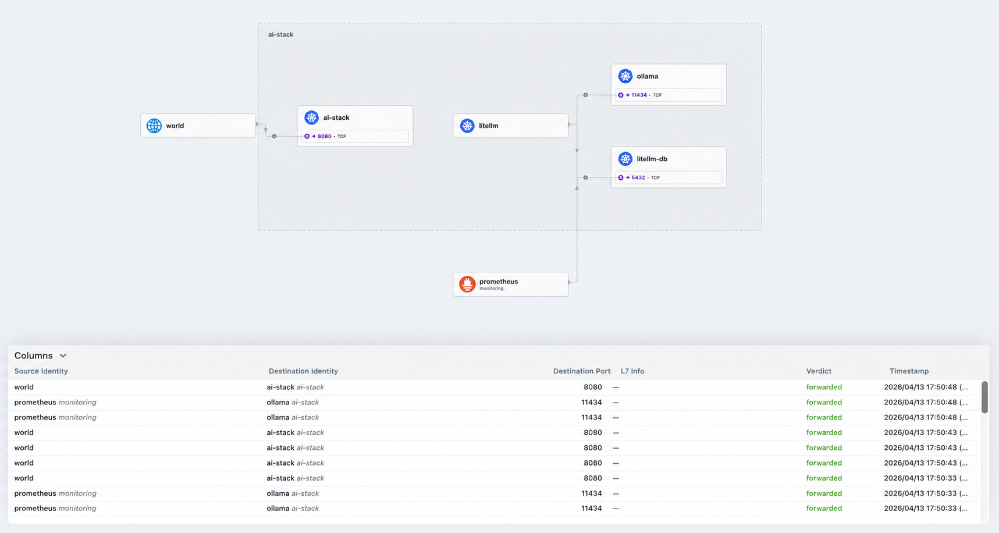
    </td>
    <td width="50%" valign="top">
      <strong>Longhorn storage</strong><br/>
      Replicated volume health, capacity, and node scheduling.<br/><br/>
      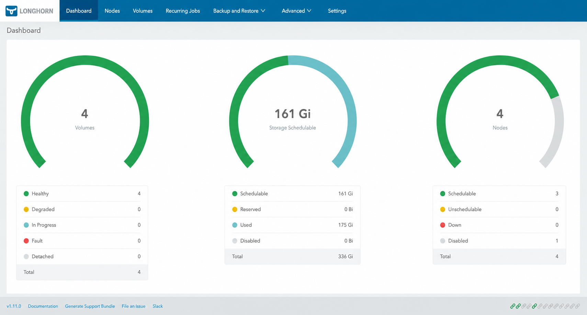
    </td>
  </tr>
  <tr>
    <td width="50%" valign="top">
      <strong>LiteLLM gateway</strong><br/>
      Centralized model usage, budgets, requests, and token accounting.<br/><br/>
      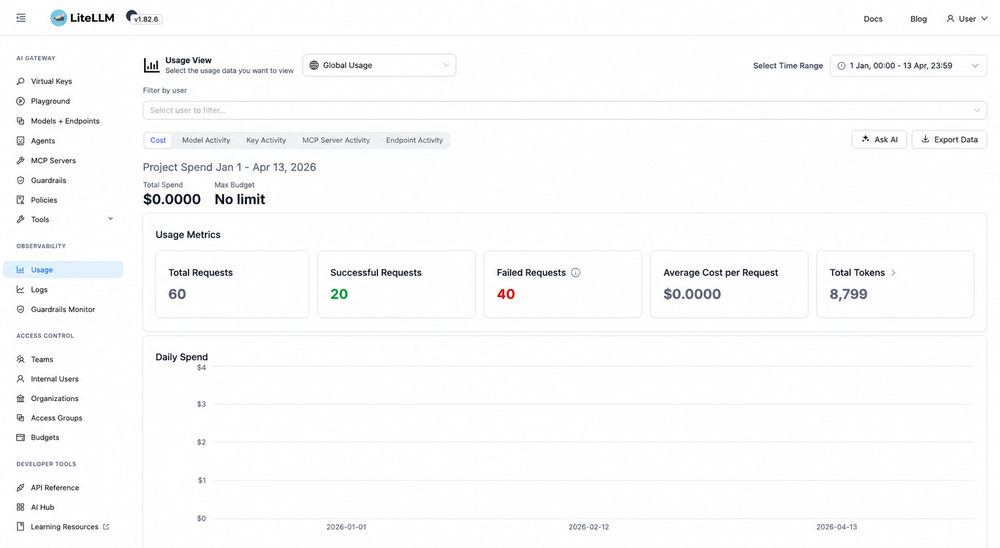
    </td>
    <td width="50%" valign="top">
      <strong>Open WebUI</strong><br/>
      Private user interface backed by the local inference platform.<br/><br/>
      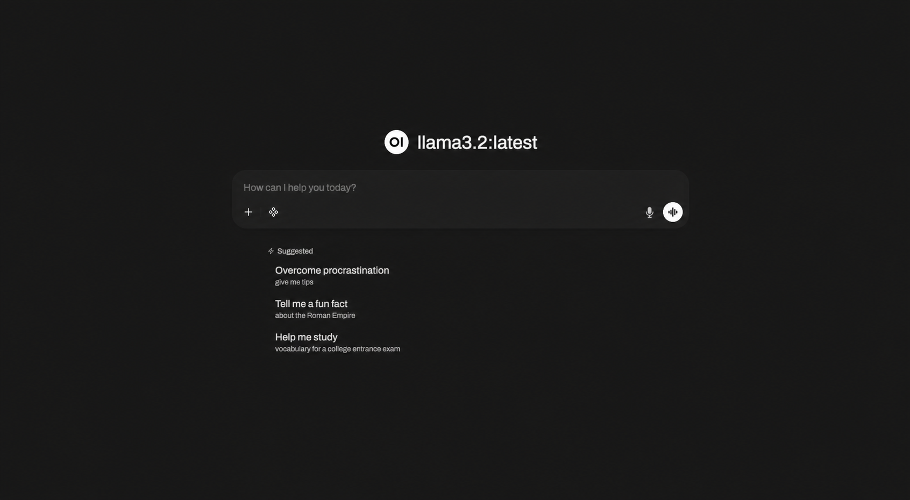
    </td>
  </tr>
</table>

## Platform layers

| Layer | Technologies | Engineering focus |
|---|---|---|
| Kubernetes | K3s, Rancher, kube-vip | HA control plane, stable API endpoint, node-role scheduling |
| Networking | Cilium, Cloudflare Tunnel | Default-deny policy, explicit flows, separated exposure paths |
| Storage | Longhorn, SMB CSI | Replication, RWO-aware rollouts, persistent application data |
| GitOps | Flux CD, Kustomize | Reconciliation, pruning, dependency ordering, drift correction |
| AI platform | Ollama, LiteLLM, Open WebUI, SearXNG | GPU inference, gateway policy, memory, search, context management |
| Observability | Prometheus, Grafana, Alertmanager | Metrics, dashboards, health signals, actionable alerts |
| Custom services | Python, FastAPI, MCP | Authenticated APIs, integrations, tests, container build contexts |

## GitOps delivery model

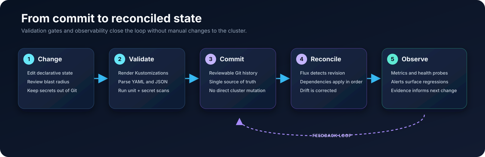

Every reconciled component has an explicit place in the dependency graph.
Infrastructure, monitoring, and application units are separated into Flux
`Kustomization` resources so a failure is visible and contained rather than
hidden inside one monolithic apply.

Representative implementation:

- [Flux reconciliation graph](./clusters/home-cluster/flux-system/kustomization.yaml)
- [Sanitized Git source and root reconciliation](./clusters/home-cluster/flux-system/gotk-sync.yaml)
- [Cluster root Kustomization](./clusters/home-cluster/kustomization.yaml)

## Local AI platform

The AI namespace is designed as a platform rather than a single chat
application:

- **Ollama** provides GPU-backed local inference.
- **LiteLLM** is the common gateway for routing, budgets, provider abstraction,
  and a unified cost ledger.
- **Open WebUI** provides the user-facing interface.
- **Memory and context services** preserve useful state without coupling it to
  the UI.
- **SearXNG and MCP tooling** provide controlled search and cluster telemetry.
- **Custom LiteLLM callbacks** normalize tool calls and compact long context
  before model limits are reached.

Files worth reviewing:

- [Context compaction callback](./clusters/home-cluster/apps/ai-stack/litellm-context-callback.py)
- [Tool-call normalizer](./clusters/home-cluster/apps/ai-stack/litellm-tool-call-normalizer.py)
- [Memory service](./clusters/home-cluster/sources/mem0-service/main.py)
- [AI platform unit tests](./clusters/home-cluster/apps/ai-stack/tests/)

## Production-style application engineering

The `suppr` directory demonstrates how I operate a stateful application on the
same platform:

- Independent web and API deployments
- PostgreSQL and Redis
- Persistent uploads and database storage
- LAN-restricted administration
- Tunnel-based public ingress
- Default-deny Cilium policy
- Health probes, resource controls, and non-root security contexts
- Scheduled notifications, digests, cleanup, and database backups

All 14 `image:` fields in this section use non-resolving, role-based
`example.invalid` placeholders. The real registries, accounts, repositories,
tags, and digests are not included.

- [Application architecture notes](./clusters/home-cluster/apps/suppr/README.md)
- [API workload](./clusters/home-cluster/apps/suppr/api.yaml)
- [Network policy](./clusters/home-cluster/apps/suppr/network-policies.yaml)
- [Backup workflow](./clusters/home-cluster/apps/suppr/pg-backup.yaml)

## Security decisions visible in the repository

- Namespace-level default deny with explicit caller egress and callee ingress
- Non-root containers, seccomp profiles, dropped capabilities, and read-only
  root filesystems where supported
- Secret references without Secret objects or encrypted ciphertext
- Separate public-tunnel, LAN-only, and in-cluster access paths
- Documentation-only IPs, node names, domains, Git remotes, and image sources
- No kubeconfigs, private keys, signing material, OAuth tokens, webhook values,
  SOPS recipients, screenshots, or live dashboard exports
- Stateful rollout strategies selected around storage access modes

## Repository tour

```text
clusters/home-cluster/
├── flux-system/       Flux bootstrap and dependency-ordered reconciliation
├── infrastructure/    kube-vip, GPU support, storage, and Rancher
├── apps/
│   ├── ai-stack/      Inference, gateway, UI, memory, search, and agents
│   └── suppr/         Sanitized production-style application architecture
├── monitoring/        Metrics, alerting, dashboards, and Cilium telemetry
├── sources/           Custom Python service build contexts and tests
└── tools/             Developer-side utilities maintained with the platform
```

